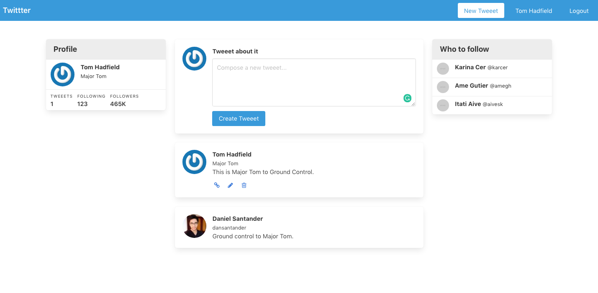

# Twittter
<br />
<p align="center">
  
  <p align="center">
  >  Basic Twitter clone<br>
    <br />
    <a href="https://github.com/dansantander/twittter"><strong>Explore the docs »</strong></a>
    <br />
    <br />
    ·
    <a href="https://github.com/dansantander/tictactoe/twittter">Report Bug</a>
    ·
    <a href="https://github.com/dansantander/tictactoe/twittter">Request Feature</a>
  </p>
</p>




<br>This project was built for creating an authentication system using Rails<br>

## Table of Contents

* [Features](#features)
* [Built With](#built-with)
* [Getting Started](#getting-start)
* [Contributing](#contributing)
* [Acknowledgments](#acknowledgments)
* [Author](#author)
* [License](#license)

## Features

<ul>
  <li>User and Posts</li>
  <li>Create and delete account, as well as edit account information</li>
  <li>Secure system to login and logout</li>
  <li>Create, change, and delete your own posts</li>
</ul>

## Built With

- Ruby 2.7 <br>
- Ruby on Rails 5.2 <br>
- Devise (AOT), gravatar (Deal with images) and simple_form
- Bulma (CSS framework)
- Rubocop (Linter) with Stickler (CI Tool) <br>
- Git, Github and VScode <br>


## Getting Start

#### Install
To use this program, you will need install:
* Ruby Language - Version 2.5 up to 2.7 - [Install guide](https://www.ruby-lang.org/en/documentation/installation/)

* Ruby on Rails - Version 5.2 - [Install guide](https://guides.rubyonrails.org/v5.0/getting_started.html#installing-rails)

* gem bundler

#### Get a local copy
Now you need a copy of this application, if you are using Git:
```js
git clone git@github.com:SevlaMare/twittor.git
```
Otherwise just hit (Download Zip) on green button (Clone or Download) at top of this page.

#### Gem Installation
Open a new terminal window and cd into the application folder.

Type in command:

```js
bundle
```

#### Run
To run, from the application folder, just type on terminal:
```js
rails server
```
Now you can go to your favorite web browser like Google Crome and access the url
<br> http://localhost:3000/

### Contributing

Contributions, issues and feature requests are welcome!

You can do it on [issues page](issues/).

## Acknowledgments

A special thanks for the code reviewers.

## Author

👤 **Daniel Santander**

- Github: [@dansantander](https://github.com/dansantander)
- Linkedin: [Daniel Santander](https://www.linkedin.com/in/daniel-santander)

### License

<strong>Creative Commons</strong>